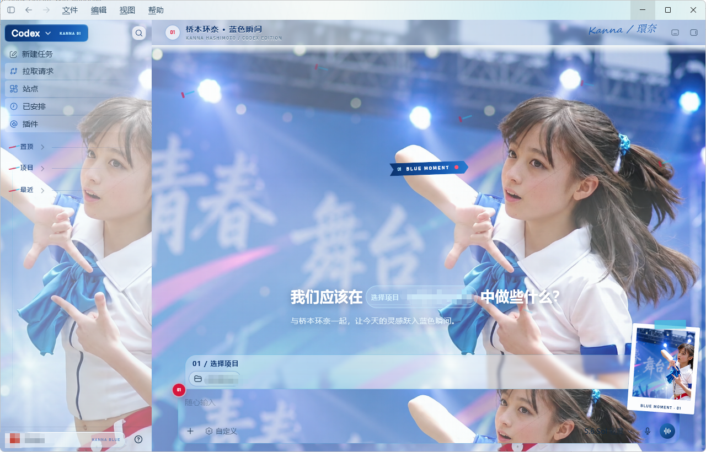
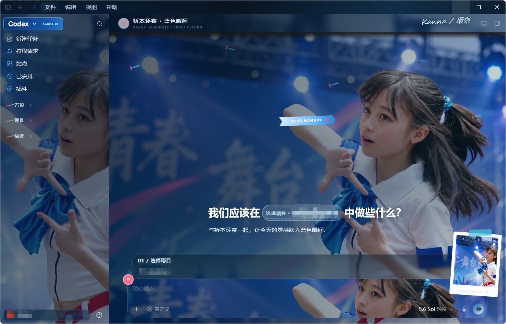
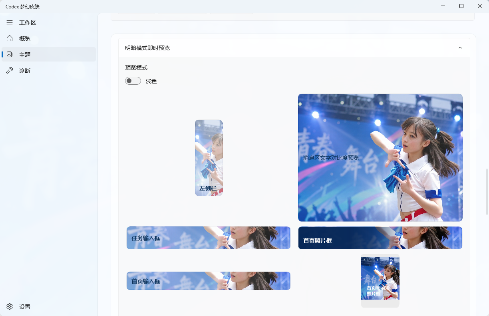
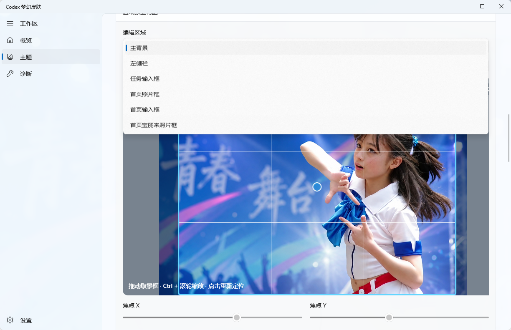
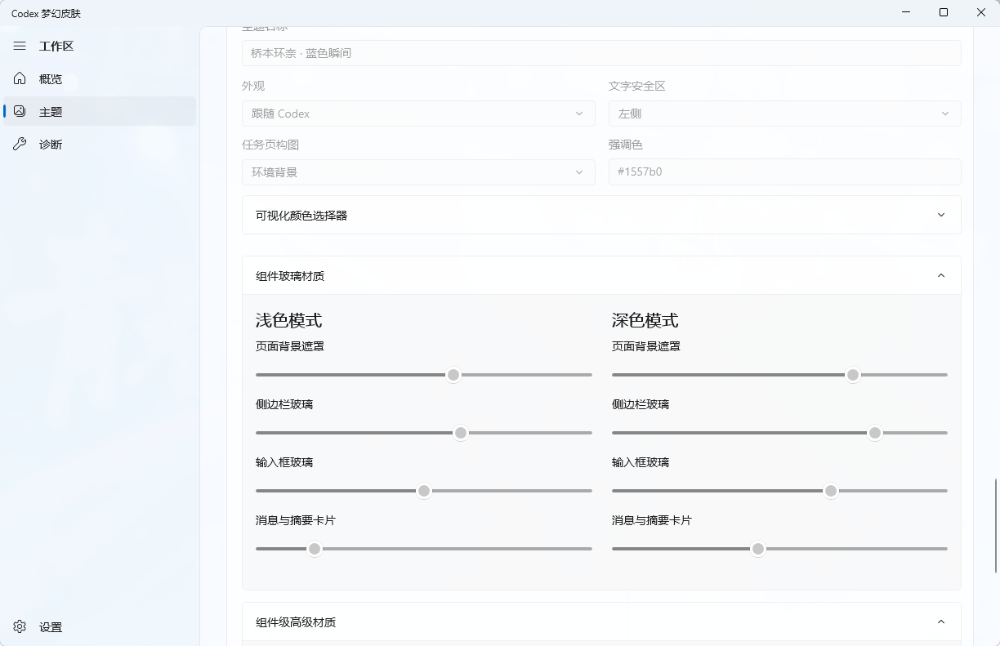
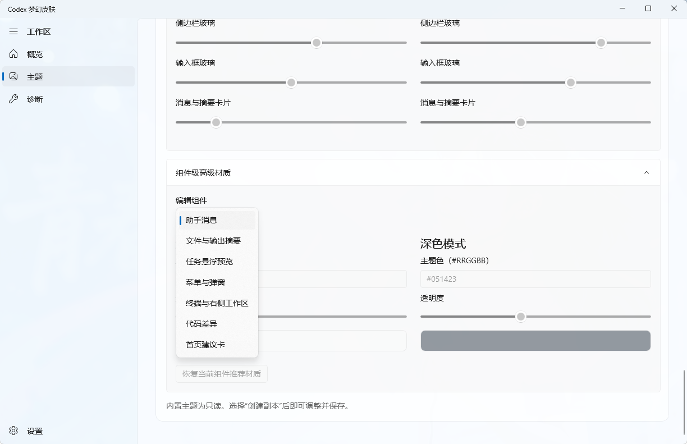
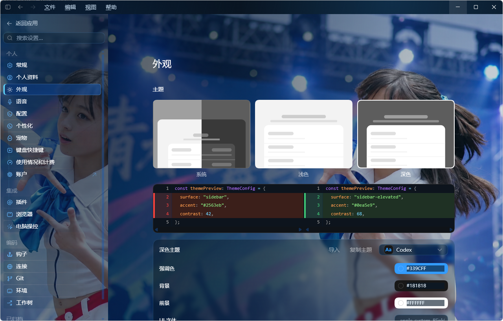
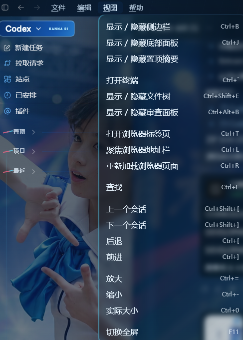

<p align="center">
  
</p>

<h1 align="center">Codex Dream Skin Windows</h1>

<p align="center">
  A visual theme studio for Codex Desktop on Windows
</p>

<p align="center">
  <a href="https://github.com/jojhaa/Codex-Dream-Skin-Windows/releases/download/v0.3.4/CodexDreamSkin-Windows-x64-v0.3.4.zip">Download portable package</a>
  ·
  <a href="https://github.com/jojhaa/Codex-Dream-Skin-Windows/releases/tag/v0.3.4">v0.3.4 release notes</a>
  ·
  <a href="./CHANGELOG.md">Changelog</a>
  ·
  <a href="./README.md">中文</a>
</p>

<p align="center">
  Windows 10 1809+ / Windows 11 · x64 · Self-contained portable package · Currently unsigned
</p>

> [!IMPORTANT]
> This software is permanently free and open source. If you paid for it, request a refund immediately. Do not trust paid sales, bundled downloads, or resale copies. The only official project is [`jojhaa/Codex-Dream-Skin-Windows`](https://github.com/jojhaa/Codex-Dream-Skin-Windows).

## Get started

### 1. Download

**[Download CodexDreamSkin-Windows-x64-v0.3.4.zip](https://github.com/jojhaa/Codex-Dream-Skin-Windows/releases/download/v0.3.4/CodexDreamSkin-Windows-x64-v0.3.4.zip)**

No .NET SDK or repository clone is required.

### 2. Extract everything

Extract the complete ZIP to a normal folder. Keep its DLL, PRI, runtime, resource, and theme files together; do not copy only the EXE.

### 3. Run and apply

Run `CodexDreamSkin.exe`, select or edit a theme in the manager, and choose the final apply action.

To reapply the theme after an ordinary Codex launch, enable live synchronization, automatic takeover, and Start with Windows in Settings.

### Verify the download

```text
SHA-256
AA43F6BF0A9F857C50534294AFBAC57D5BCC7B559F188BA6AEC98B5A175D17B9
```

> [!NOTE]
> The current portable build is unsigned, so Windows may show a security prompt on first launch. Confirm that the download came from this repository and verify its SHA-256. Until signing is available, do not use third-party distribution channels.

## What it can do

| Workspace | Capabilities |
| --- | --- |
| Artwork composition | Six independent regions: main background, sidebar, task composer, home hero, home composer, and Polaroid |
| Precise framing | Focus X/Y, zoom, fit mode, horizontal/vertical offsets, and non-destructive viewports based on real Codex proportions |
| Appearance preview | Instant light/dark switching across the sidebar, messages, composers, and Home |
| Automatic palette | Main/accent color extraction, skin-tone avoidance, contrast checks, and visual color controls |
| Glass materials | Separate controls for messages, summaries, task previews, menus, workspace panels, code/diffs, and Home suggestions |
| Theme management | Library, import/export, duplicate, history, rollback, and recommended-composition recovery |
| Runtime experience | Hot reload, normal-launch auto-apply, Start with Windows, native tray, double-click restore, and right-click navigation |
| Guarded diagnostics | Current Store-package discovery, local port inspection, process-identity verification, and protected close controls |
| Localization | Chinese File, Edit, View, and Help menus with theme-aware light/dark popup materials |

## Results

### Codex light and dark modes

<table>
  <tr>
    <td width="50%" align="center">
      
      <br>
      <sub>Light mode</sub>
    </td>
    <td width="50%" align="center">
      
      <br>
      <sub>Dark mode</sub>
    </td>
  </tr>
</table>

### Theme manager

<table>
  <tr>
    <td width="50%" align="center">
      
      <br>
      <sub>True-ratio instant preview</sub>
    </td>
    <td width="50%" align="center">
      
      <br>
      <sub>Independent composition and framing</sub>
    </td>
  </tr>
  <tr>
    <td width="50%" align="center">
      
      <br>
      <sub>Light and dark glass materials</sub>
    </td>
    <td width="50%" align="center">
      
      <br>
      <sub>Per-component advanced materials</sub>
    </td>
  </tr>
</table>

### Settings and translated menus

<table>
  <tr>
    <td width="68%" align="center">
      
      <br>
      <sub>Themed Settings page</sub>
    </td>
    <td width="32%" align="center">
      
      <br>
      <sub>Chinese File, Edit, View, and Help menus</sub>
    </td>
  </tr>
</table>

## How it works

```text
Codex Dream Skin manager
        │
        ├─ Manages artwork, palette, materials, and composition
        ├─ Applies the theme through loopback CDP on 127.0.0.1
        └─ Hot-reloads the current Codex renderer

Official Codex files remain unchanged
```

The launcher dynamically discovers the current Microsoft Store Codex package and real process path, so updates do not depend on a stale version-specific directory.

## Safety boundary

| It does | It does not |
| --- | --- |
| Uses a local CDP session bound only to `127.0.0.1` | Patch or re-sign the Codex installation |
| Revalidates package and process identity before takeover or close actions | Write to `WindowsApps` or unpack `app.asar` |
| Stores themes, backups, and settings in the user profile | Change API Base URLs, API keys, or account data |
| Runs the native Windows tray inside the manager process | Install a hidden PowerShell tray shortcut |
| Provides explicit restore and diagnostics paths | Expose the debugging endpoint to the local network |

Do not run untrusted local software while CDP is enabled.

## Source and development

Ordinary users only need the portable package above. The following instructions are for developers and script-based workflows.

### Run the manager from source

Install the [.NET 10 SDK](https://dotnet.microsoft.com/download/dotnet/10.0).

```powershell
git clone https://github.com/jojhaa/Codex-Dream-Skin-Windows.git
cd Codex-Dream-Skin-Windows\windows
dotnet run --project .\app\CodexDreamSkin\CodexDreamSkin.csproj -c Release -p:Platform=x64
```

### Build an x64 portable package

```powershell
cd Codex-Dream-Skin-Windows\windows
dotnet publish .\app\CodexDreamSkin\CodexDreamSkin.csproj `
  -c Release `
  -p:Platform=x64 `
  -r win-x64 `
  -p:PortableExe=true `
  -o ..\release\CodexDreamSkin-win-x64
```

### Script workflow

```powershell
# Install and start the theme engine
powershell -ExecutionPolicy RemoteSigned -File .\scripts\install-dream-skin.ps1
powershell -ExecutionPolicy RemoteSigned -File .\scripts\start-dream-skin.ps1

# Verify the environment and active theme
powershell -ExecutionPolicy RemoteSigned -File .\scripts\verify-dream-skin.ps1

# Restore the original Codex appearance
powershell -ExecutionPolicy RemoteSigned -File .\scripts\restore-dream-skin.ps1
```

### Development checks

```powershell
cd windows
powershell -ExecutionPolicy Bypass -File .\tests\run-tests.ps1
dotnet build .\app\CodexDreamSkin\CodexDreamSkin.csproj -c Release -p:Platform=x64 -nologo
```

## Repository layout

```text
windows/
├── app/CodexDreamSkin/    # Native WinUI 3 theme manager
├── assets/                # Default theme, CSS, injector payload, and sample artwork
├── presets/               # Bundled theme presets
├── scripts/               # Install, launch, apply, verify, and restore scripts
├── tests/                 # PowerShell, Node.js, and live UI regression tests
├── references/            # Windows runtime and QA notes
└── SKILL.md               # Codex automation workflow
```

## Known limitations

- The theme follows Codex's current Electron/Chromium DOM; a major Codex update may require selector updates.
- Normal-launch auto-apply is an optional user-level takeover feature. When disabled, an ordinary Codex launch does not automatically include the theme.
- Live UI tests require a locally running Codex instance with a managed CDP session.
- This is an unofficial project and is not affiliated with or endorsed by OpenAI.

## Acknowledgements

Thanks to [`Fei-Away/Codex-Dream-Skin`](https://github.com/Fei-Away/Codex-Dream-Skin) for the original idea and foundation for external Codex theming. This repository independently rebuilds and maintains that work for Windows.
